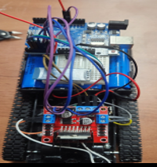

# 🚗 ESP32 RC Car

ESP32 기반 WiFi RC카 프로젝트입니다.  
웹 브라우저에서 버튼을 눌러 실시간으로 RC카를 제어할 수 있습니다.

> ⚠️ **주의**: 이 프로젝트는 코드 정리 단계로, 실제 하드웨어 테스트가 완료되지 않았습니다.  
> 배선 전 반드시 본인의 ESP32 보드 핀맵을 확인하고 핀 번호를 수정하세요.

---

## 📦 구성 파일

| 파일 | 설명 |
|------|------|
| `rc_car.ino` | ESP32 WiFi 서버 + 모터 제어 코드 |
| `control.html` | 웹 조작 UI (브라우저에서 실행) |

---

## 🛠 하드웨어 구성

- ESP32 개발보드
- L298N 모터 드라이버
- DC 모터 2개
- 배터리 (7.4V 권장)

### 핀 연결 (L298N ↔ ESP32)

> ⚠️ 아래 핀 번호는 코드 기본값입니다. ESP32 보드 종류(DevKit v1, NodeMCU-32S 등)에 따라  
> 핀맵이 다를 수 있으므로, 배선 전 본인 보드의 데이터시트를 확인 후 `rc_car.ino`에서 수정하세요.

| L298N 핀 | ESP32 GPIO |
|----------|------------|
| IN1 | 17 |
| IN2 | 18 |
| IN3 | 22 |
| IN4 | 23 |

핀 번호 변경은 `rc_car.ino` 상단에서 할 수 있습니다.

```cpp
int IN1 = 17;  // 필요시 수정
int IN2 = 18;
int IN3 = 22;
int IN4 = 23;
```

---

## ⚙️ 사용 방법

### 1. WiFi 설정

`rc_car.ino` 상단의 WiFi 정보를 본인 환경에 맞게 수정하세요.

```cpp
const char* ssid = "YOUR_WIFI_SSID";
const char* password = "YOUR_WIFI_PASSWORD";
```

### 2. ESP32에 업로드

Arduino IDE에서 보드를 **ESP32 Dev Module**로 설정 후 업로드합니다.

### 3. IP 주소 확인

시리얼 모니터(115200 baud)를 열면 연결된 IP 주소가 출력됩니다.


### 4. control.html 수정

`control.html` 내 IP 주소를 ESP32의 실제 IP로 변경하세요.

```javascript
const esp32_ip = "http://192.168.x.x";  // ← 여기 수정
```

### 5. 브라우저에서 실행

`control.html`을 브라우저로 열면 조작 UI가 표시됩니다.  
ESP32와 **같은 WiFi 네트워크**에 연결된 상태여야 합니다.

---

## 🎮 제어 명령

| 버튼 | 동작 |
|------|------|
| 전진 | `/control?cmd=forward` |
| 후진 | `/control?cmd=backward` |
| 좌회전 | `/control?cmd=left` |
| 우회전 | `/control?cmd=right` |
| 정지 | `/control?cmd=stop` |

---

## 📋 개발 환경

- Arduino IDE 1.8 이상
- ESP32 보드 패키지 설치 필요
  - 보드 매니저 URL: `https://dl.espressif.com/dl/package_esp32_index.json`
- 사용 라이브러리: `WiFi.h`, `WebServer.h` (ESP32 패키지 기본 포함)

## 📷 하드웨어


